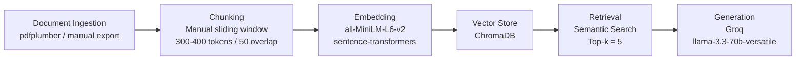

# Project 1 Planning: The Unofficial Guide

## Domain

<!-- What domain did you choose? Why is this knowledge valuable and hard to find through official channels? -->
Course & professor reviews.

This was chosen because there are multiple places to gain the knowledge for a single course. For example, I could learn about the spite reviews from students who did bad on rate my professor, or I could learn about the good reviews from students who did great on a discord community server. In addition, the same could be said about the course material itself. For example, I could look at the official school website for details, but what if I want the syllabus or previous exams.

---

## Documents

<!-- List your specific sources: URLs, subreddit names, forum threads, or file descriptions.
     Aim for at least 10 sources that together cover different subtopics or perspectives within your domain. -->

| # | Source | Description | URL or location |
|---|--------|-------------|-----------------|
| 1 |rate my professors| Where students rate their professors, might be negatively biased however.|https://www.ratemyprofessors.com/ |
| 2 | BC CS department official website| Department website with various amounts of information|https://www.brooklyn.edu/academics/programs/computer-science-bs/ |
| 3 |Course syllabis for Graduate students | Links syllabi for all graduate courses |https://www.brooklyn.edu/cis/graduate/ |
| 4 |Course syllabis for Undergraduate students | Links syllabi for undergrad courses|https://www.brooklyn.edu/cis/undergraduate/ |
| 5 | Advice brochure for Graduates| Helpful information gathered by the CS department regarding the entire program|https://www.sci.brooklyn.cuny.edu/cis/graduate.pdf |
| 6 | Advice brochure for Undergrads|Helpful information gathered by the CS department regarding the entire program |https://www.sci.brooklyn.cuny.edu/cis/undergraduate.pdf |
| 7 | /r/cuny| Subreddit for information regarding all of CUNY (overlaps with other CUNY schools and non-CS information though) |https://www.reddit.com/r/CUNY/ |
| 8 | r/BrooklynCollege| Subreddit for Brooklyn College specifically, less active than r/CUNY though|https://www.reddit.com/r/BrooklynCollege/ |
| 9 |Brooklyn college CS club | Information from the students that make the CS club at Brooklyn|https://bccs.club/ |
| 10 | Brooklyn college CS discord|LOTS of information about Computer Science at brooklyn college|https://discord.com/invite/C77eXN8bHT |

---

## Chunking Strategy

<!-- How will you split documents into chunks?
     State your chunk size (in tokens or characters), overlap size, and explain why those
     numbers fit the structure of your documents.
     A review-heavy corpus warrants different chunking than a long FAQ. -->

**Chunk size:**
300 - 400 tokens
**Overlap:**
50 tokens
**Reasoning:**
Most of the sources are short-form almost fixed sized content. For example, rateMyProfessor, reddit, and discord would all fall under this. However, the pdfs and website while being long, also have short content because they are seperated by paragraphs. Having a 50 token overlap makes sure that sentences being spilt are not lost while also being small enough for the chunk size.

---

## Retrieval Approach

<!-- Which embedding model are you using (e.g., all-MiniLM-L6-v2 via sentence-transformers)?
     How many chunks will you retrieve per query (top-k)?
     If you were deploying this for real users and cost wasn't a constraint, what tradeoffs
     would you weigh in choosing a different embedding model — context length, multilingual
     support, accuracy on domain-specific text, latency? -->

**Embedding model:**
all-MiniLM-L6-v2 via sentence transformers
**Top-k:**
5
**Production tradeoff reflection:**
If this was actual production, I'd weigh the tradeoffs with latency and context length. A local model would be able to handle that but it's less accurate and has a smaller context window compared to something like an API based model. 

## Evaluation Plan

<!-- List your 5 test questions with their expected correct answers.
     Questions should be specific enough that you can judge whether the system's response
     is right or wrong. "What are good dining halls?" is too vague.
     "What do students say about wait times at [dining hall name] during lunch?" is testable. -->

| # | Question | Expected answer |
|---|----------|-----------------|
| 1 |What programming languages are CS undergrad students required to learn? | Java|
| 2 |What specialization does the CS deparmtnet recommend for a graduate student that wishes to pursue a PhD? | Computation |
| 3 | Are [specific professor]'s exams pen and paper? Short answers or multiple choice? And are they allowed a cheat sheet?| Pen & paper, short answers, and yes|
| 4 |What negative feedback do students give about [specific professor]?| Heavily weighted final exam, self studying, needs to retire|
| 5 |If I take the expedited masters as an undergrad student, does taking the gradute level computer theory course fulfill both undergrad and grad requirements at the same time? | Yes |

---

## Anticipated Challenges

<!-- What could go wrong? Name at least two specific risks with reasoning.
     Consider: noisy or inconsistent documents, missing source attribution, off-topic
     retrieval, chunks that split key information across boundaries. -->

1. The discord server is a challenge because I will have to figure out how to export the server messages, and after that I will have to clean the data. The raw export might include usernames, timestamps, and emojis that would be noise for retrieval. It could end up in chunks and hurt the accuracy.

2. RateMyProfessor is also a challenge because it does not have a public API, so collecting the reviews requires manual copy/pasting or webscraping, which may also require cleaning. Also, the dataset might be biased towards extreme opinions (top reviews) if not thoroughly checked.

---

## Architecture

<!-- Draw a diagram of your pipeline showing the five stages:
     Document Ingestion → Chunking → Embedding + Vector Store → Retrieval → Generation
     Label each stage with the tool or library you're using.
     You can use ASCII art, a Mermaid diagram, or embed a sketch as an image.
     You'll use this diagram as context when prompting AI tools to implement each stage. -->

---

## AI Tool Plan

<!-- For each part of the pipeline below, describe:
     - Which AI tool you plan to use (Claude, Copilot, ChatGPT, etc.)
     - What you'll give it as input (which sections of this planning.md, which requirements)
     - What you expect it to produce
     - How you'll verify the output matches your spec

     "I'll use AI to help me code" is not a plan.
     "I'll give Claude my Chunking Strategy section and ask it to implement chunk_text()
     with my specified chunk size and overlap" is a plan. -->
Ingestion & Chunking: I'll give Claude my document list (10 sources) and ask it to implement a function that handles .txt and .pdf files using pdfplumber. I'll verify it works by checking that each document loads without error. For chunking, I will ask it to implement a chunking function with 300-400 tokens and 50 token overlap. I will verify by manually testing ane example document and checking that the chunks created are the correct size and the overlap is happening.

Embeddeding & Retrieval: I'll give Claude the sections of the .md alongside the specific model (all-minilm-l6-v2) and ChromaDB, and ask it to create a function that embeds the chunks. I will verify by checking that each chunk turns into a list of numbers. Also, I will ask them to implement a function that stores those same chunks into the database, and I will verify by querying ChromaDB and checking the number of stored chunks matches the chunks embedded. Finally, for retrieval, I will ask Claude to implement a function that accepts a user query and returns the 5 most relevant chunks then I will verify it by checking the 5 returned checks are actually relevant to the query.

Generation & Interface: I'll give Claude the sections again, alongside the llm choice (groq) and ask it to implement a function that takes those chunks and gives it to groq to produce a final answer (with sources). I'll verify by running a query and checking if the response if accurate with the included citation showing where the answer came from. For the interface, I will use the recommended Gradio web UI and build a simple CLI.

**Milestone 3 — Ingestion and chunking:**

**Milestone 4 — Embedding and retrieval:**

**Milestone 5 — Generation and interface:**
